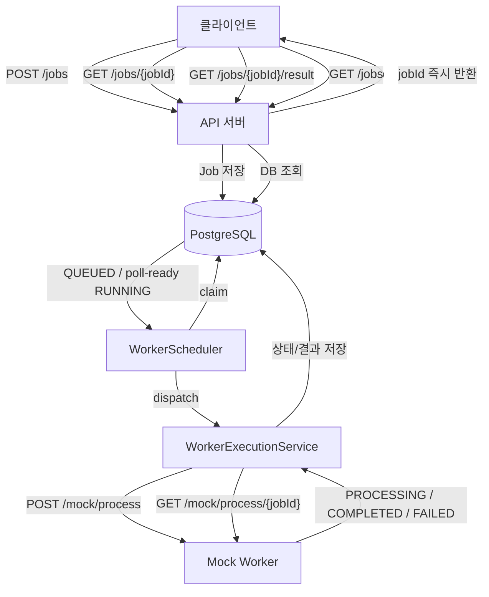
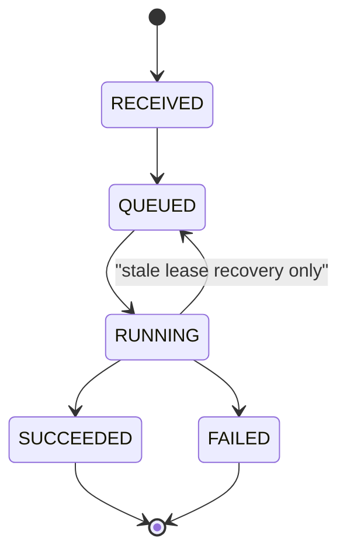
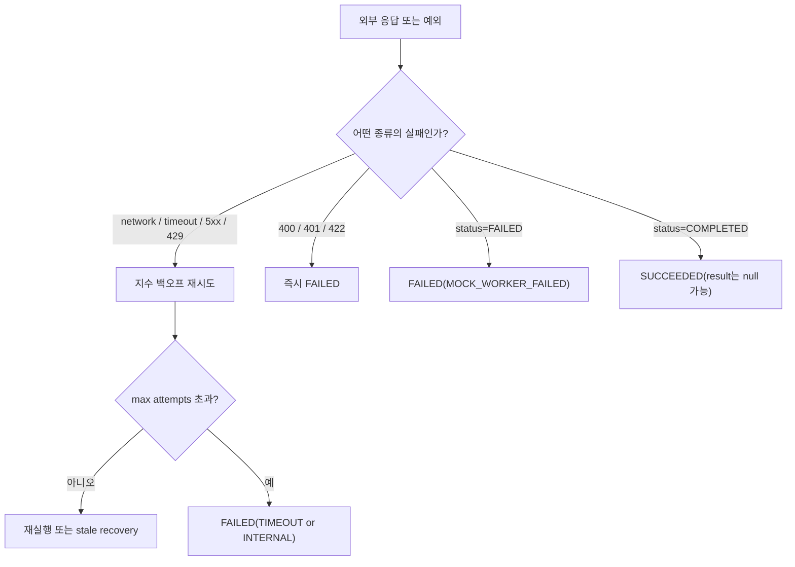

# REALTEETH Backend assignment

외부 이미지 처리 시스템을 안전하게 오케스트레이션하기 위한 비동기 작업 서버입니다.  
클라이언트는 작업 생성 직후 `jobId`를 받아 빠르게 응답받고, 실제 이미지 처리는 백그라운드 워커가 Mock Worker에 위임합니다. 서버는 그 진행 상태와 결과를 데이터베이스에 영속화해, 지연이 큰 외부 시스템과 서버 재시작 상황에서도 일관된 조회 경험을 제공하도록 설계했습니다.

## 설계 목표와 판단 기준

이 시스템은 아래 기준을 먼저 정한 뒤 설계를 진행했습니다.

- 클라이언트 요청은 외부 처리 시간과 분리되어야 한다.
- 작업 상태는 메모리가 아니라 DB에 남아야 한다.
- 중복 요청과 동시성 경쟁은 애플리케이션 코드가 아니라 DB가 최종적으로 막아야 한다.
- 외부 시스템은 느리고, 실패하고, 때로는 이상한 응답을 줄 수 있다고 가정해야 한다.

외부 호출의 exactly-once 보장은 이 구조에서 현실적으로 어렵습니다. 대신 외부 호출은 at-least-once를 전제로 두고, 내부적으로는 멱등한 작업 생성과 final state 불변성으로 결과 일관성을 유지하도록 설계했습니다.

## 전체 아키텍처



핵심은 요청 수신 경로와 실제 처리 경로를 분리한 것입니다. `POST /jobs`는 DB에 작업만 기록하고 끝나며, 외부 호출은 스케줄러와 워커가 별도 경로에서 수행합니다. 이렇게 해야 외부 시스템 지연이 API 응답 시간에 전파되지 않고, 실패나 재시작 상황에서도 상태를 다시 따라갈 수 있습니다.

## 상태 모델 설계 의도

내부 상태 모델은 아래와 같습니다.

`RECEIVED -> QUEUED -> RUNNING -> SUCCEEDED/FAILED`



이 모델을 선택한 이유는 각 상태가 서로 다른 책임을 표현하기 때문입니다.

### 왜 `RECEIVED`가 필요한가

`RECEIVED`는 “요청을 정상 수신했고 내부 식별자를 발급했다”는 의미입니다. 이 상태가 있어야 `POST /jobs`의 응답 의미가 명확해집니다. 실제로 내부 저장 직후 곧바로 `QUEUED`로 옮기더라도, 클라이언트 입장에서는 “요청이 서버에 받아들여졌다”는 이벤트와 “워커 실행 대기열에 들어갔다”는 이벤트를 구분할 수 있어야 합니다.

### 왜 `QUEUED`가 필요한가

`QUEUED`는 API 처리와 외부 실행을 분리하는 상태입니다. 요청을 받은 스레드가 직접 Mock Worker를 호출하지 않는 이상, “저장됨”과 “실행 중” 사이에 반드시 대기 상태가 있어야 합니다. 이 상태가 있어야 처리량이 몰려도 요청 수신 자체는 빠르게 끝낼 수 있고, 백그라운드 워커 수에 맞춰 실행량을 제어할 수 있습니다.

### 왜 `RUNNING`이 필요한가

`RUNNING`은 단순히 외부 요청을 보냈다는 뜻이 아니라, 이 서버가 해당 작업의 실행 책임을 잡고 있다는 뜻입니다. lease, `external_job_id`, `next_poll_at`, `processing_started_at` 모두 이 상태를 중심으로 동작합니다. Mock Worker의 `PROCESSING`을 그대로 내부 `RUNNING`으로 매핑한 이유도 동일합니다.

### 왜 final state를 불변으로 두었는가

`SUCCEEDED`, `FAILED`에서 다시 다른 상태로 움직이게 두면 재시도, 중복 poll, 재시작 복구 시점마다 정합성이 흔들립니다. 그래서 이 시스템은 일단 최종 상태로 들어가면 더 이상 전이하지 않도록 고정했습니다. 외부 호출이 중복되더라도 결과 저장은 한 번만 의미 있게 일어나도록 만들기 위한 선택입니다.

### 허용 전이와 예외 전이

허용 전이는 아래 다섯 개만 둡니다.

- `RECEIVED -> QUEUED`
- `QUEUED -> RUNNING`
- `RUNNING -> SUCCEEDED`
- `RUNNING -> FAILED`
- `RUNNING -> QUEUED` (lease가 만료된 stale job 복구 시에만 허용)

여기서 `RUNNING -> QUEUED`는 일반 재시도가 아니라, 워커가 죽었거나 lease를 잃어 실행 책임을 다시 큐로 돌려보내는 복구 동작입니다. 즉 상태 머신의 예외가 아니라, 장애 복구를 위한 의도적인 전이입니다.

### 진행률 표현

클라이언트가 단계감을 가질 수 있도록 상태를 아래와 같이 단순 매핑했습니다.

| 상태 | progress |
| --- | ---: |
| `RECEIVED` | 0 |
| `QUEUED` | 10 |
| `RUNNING` | 50 |
| `SUCCEEDED` | 100 |
| `FAILED` | 100 |

정밀한 퍼센트라기보다는 사용자에게 현재 단계를 보여주기 위한 값입니다. 외부 처리의 실제 세부 진행률은 알 수 없기 때문에, 서버가 확실히 알고 있는 상태만 노출하도록 했습니다.

## 외부 시스템 연동 방식 및 선택 이유

Mock Worker와의 연동은 아래 세 엔드포인트로 고정됩니다.

| 목적 | 메서드 / 경로 | 사용 방식 |
| --- | --- | --- |
| API Key 발급 | `POST /mock/auth/issue-key` | `APP_MOCK_API_KEY`가 없을 때 지연 호출 |
| 작업 시작 | `POST /mock/process` | 내부 job이 처음 실행될 때 호출 |
| 상태 조회 | `GET /mock/process/{jobId}` | 외부 `jobId` 저장 후 반복 조회 |

외부 상태와 내부 상태의 매핑은 아래와 같습니다.

| Mock Worker 상태 | 내부 상태 |
| --- | --- |
| `PROCESSING` | `RUNNING` |
| `COMPLETED` | `SUCCEEDED` |
| `FAILED` | `FAILED` |

### 왜 polling인가

이 시스템은 webhook이 없는 외부 SaaS를 다루는 오케스트레이터라고 가정했습니다. 외부 시스템 내부 구현은 바꿀 수 없고, 콜백 채널도 보장되지 않습니다. 따라서 상태 동기화 방법은 polling이 가장 현실적입니다.

단순한 `Thread.sleep` polling은 워커 스레드를 오래 점유합니다. 그래서 `PROCESSING`이면 `next_poll_at`만 DB에 기록하고 lease를 내려놓은 뒤 종료하고, 스케줄러가 나중에 다시 claim해서 한 번 더 poll하는 구조를 사용했습니다. 이 방식은 재시작 복구와도 잘 맞습니다.

## 실패 처리 전략

실패 전략의 핵심은 “다시 하면 나아질 실패인가, 그렇지 않은 실패인가”를 먼저 나누는 것입니다. 외부 시스템이 불안정하다는 전제 때문에 모든 실패를 같은 방식으로 다루면 오히려 자원을 낭비하거나 상태를 더 늦게 확정하게 됩니다.

### ErrorCode 정의

| ErrorCode | 의미 | 대표 발생 조건 | 재시도 |
| --- | --- | --- | --- |
| `MOCK_WORKER_FAILED` | 외부가 정상 응답으로 실패를 확정 | Mock Worker `status=FAILED` | 아니오 |
| `TIMEOUT` | 시간 초과 또는 장시간 정체 | 네트워크 timeout, stale exhausted | 예, exhausted 전까지 |
| `RATE_LIMITED` | 외부 rate limit | HTTP `429` | 예 |
| `UNAUTHORIZED` | 인증 실패 | HTTP `401` | 아니오, 단 자동 발급 key는 1회 self-healing 예외 |
| `BAD_REQUEST` | 잘못된 요청 | HTTP `400`, `422` | 아니오 |
| `INTERNAL` | 서버 내부 오류 또는 외부 5xx 계열 오류 | HTTP `5xx`, 예기치 않은 내부 예외 | 경우에 따라 예, 단 final failure 시 종료 |

### 재시도 가능한 실패와 불가능한 실패

재시도 가능한 실패는 네트워크 오류, timeout, `5xx`, `429`입니다. 이들은 외부 시스템 상태나 일시적 환경 문제 때문에 발생할 수 있으므로 지수 백오프로 다시 시도합니다.

반대로 `400`, `401`, `422`, 그리고 Mock Worker가 명시적으로 `FAILED`를 반환한 경우는 fail-fast로 처리합니다. 이 경우에는 같은 요청을 같은 방식으로 다시 보내도 좋아질 가능성이 낮고, 자동 재시도는 오히려 외부 자원만 더 소모합니다.

### 성공 결과는 없을 수도 있다

Mock Worker OpenAPI상 `result`는 nullable입니다. 따라서 `status=COMPLETED`인데 `result=null`인 응답도 정상 성공의 한 형태로 해석합니다. 현재 구현도 이 계약을 그대로 따르며, 내부 상태는 `SUCCEEDED`, 조회 응답은 `{"result": null}` 형태를 허용합니다.



실패 처리에서는 재시도 여부만큼이나 언제 최종 실패로 확정할지도 중요합니다. 외부가 느리다는 이유만으로 작업이 계속 `RUNNING`에 머물면 관측성과 운영성이 함께 나빠지기 때문입니다.

## 동시 요청 발생 시 고려 사항

이 시스템에서 중복 요청 처리는 `Idempotency-Key`를 중심으로 설계했습니다. 현재 `POST /jobs`는 이 헤더가 필수이며, 같은 key로 요청이 다시 들어오면 기존 `jobId`를 반환합니다.

### 왜 `Idempotency-Key`를 필수로 두었는가

초기에는 서버가 `imageUrl`로 같은 요청을 추론하도록 만들 수도 있었습니다. 하지만 같은 이미지라도 “같은 요청”이라고 단정할 수는 없습니다. 사용자는 같은 이미지를 다른 시점에 다시 처리하고 싶을 수 있고, 같은 URL이라도 요청 의도는 다를 수 있습니다. 요청 의미는 서버가 추론하는 것보다 클라이언트가 명시하는 편이 더 정확합니다.

그래서 현재 계약은 “멱등성 판단의 책임은 클라이언트가 가진다”는 방향으로 고정했습니다. 같은 요청을 재전송하려면 같은 `Idempotency-Key`를 쓰고, 같은 이미지를 새 작업으로 다시 처리하고 싶다면 새로운 key를 보내면 됩니다.

### 왜 DB를 최종 방어선으로 두었는가

애플리케이션 레벨에서 “이미 있는지 조회 후 없으면 insert”를 해도, 동시성 상황에서는 둘 다 조회 시점에는 비어 있다고 보고 들어올 수 있습니다. 그래서 최종 중복 차단은 반드시 DB가 해야 합니다.

현재는 `idempotency_key`에 유니크 제약을 두고, 삽입 경합은 `ON CONFLICT` 기반으로 처리합니다. 즉 중복 판단의 의미는 애플리케이션이 정하고, 실제 경쟁 상황의 승패는 DB가 정합니다.

## 트래픽 증가 시 병목 가능 지점

이 과제에서 중요한 병목은 CPU보다 외부 시스템과 동시성 제어입니다.

| 병목 지점 | 왜 병목이 되는가 | 현재 완화 방식 | 남는 한계 |
| --- | --- | --- | --- |
| 외부 worker latency | 응답 시간이 수 초에서 수십 초까지 변동 가능 | 비동기 처리, `next_poll_at` 재스케줄 | 외부 자체 속도는 줄일 수 없음 |
| rate limiting (`429`) | 짧은 시간에 요청이 몰리면 외부가 거절 가능 | retry + backoff | 지속적 과부하는 결국 지연 증가 |
| DB claim contention | 여러 워커가 같은 큐를 동시에 집으려 할 수 있음 | `FOR UPDATE SKIP LOCKED`, batch claim | DB 자체가 병목이면 한계 존재 |
| worker dispatch capacity | 실행 가능한 스레드보다 많이 claim하면 lease만 쌓일 수 있음 | executor `active + queue` 기반 capacity 보호 | worker 수 자체가 적으면 처리량은 제한됨 |
| 장시간 `PROCESSING` | 오래 걸리는 외부 작업이 worker 점유를 유발 | `next_poll_at`, max processing timeout, stale recovery | 외부 작업이 근본적으로 느리면 전체 지연은 남음 |

> 이 한계들은 놓친 문제가 아니라, 현재 구조에서 의식적으로 구분해 둔 운영 제약입니다. 
> 
> 지연과 실패를 API 경로에서 분리하고 상태를 일관되게 관리하는 데 우선순위를 두었습니다. 예를 들어 외부 latency와 rate limit은 서버 내부 코드만으로 제거할 수 있는 문제가 아니고, DB contention이나 dispatch capacity는 더 개선할 수 있지만 큐 샤딩, 우선순위 스케줄링, 별도 rate limiter 같은 추가 복잡도를 요구합니다. 
> 
> 이번 설계는 그런 확장 비용보다 비동기 처리, 재시작 복구, 중복 요청 안전성, 최종 상태 일관성을 먼저 고정하는 쪽이 더 중요하다는 전제 위에서 정리했습니다.

추가로 스케줄러는 `poll-ready RUNNING`과 신규 `QUEUED`를 slot reservation으로 균형 배분합니다. 신규 작업만 계속 처리하면 이미 외부에서 시작된 작업의 완료 확인이 밀리고, 반대로 poll-ready만 우선하면 신규 작업이 굶을 수 있기 때문입니다.

## 처리 보장 모델과 재시작 시 동작

### 처리 보장 모델

이 시스템의 처리 보장 모델은 외부 호출 관점에서는 at-least-once입니다. 재시도, stale recovery, 재시작 복구가 있기 때문에 외부 API 호출이 완전히 한 번만 일어난다고 보장할 수는 없습니다.

대신 내부 결과 관점에서는 “한 번 final state에 들어가면 더 이상 바뀌지 않는다”는 규칙을 두고, 결과 저장도 final transition 시점에만 수행합니다. 이 덕분에 외부 호출이 중복될 가능성이 있어도, 최종적으로 클라이언트가 관측하는 내부 결과는 일관되게 유지됩니다.

### 재시작 시 동작

서버가 재시작돼도 작업 상태는 DB에 남아 있습니다. 따라서 복구의 출발점은 메모리가 아니라 DB입니다.

- `QUEUED` 작업은 다시 claim됩니다.
- lease가 만료된 `RUNNING` 작업은 stale로 판단해 `QUEUED`로 되돌립니다.
- `attempt_count >= max_attempts`인 stale 작업은 `FAILED(TIMEOUT)`으로 종결합니다.
- `external_job_id`와 `next_poll_at`가 남아 있으면 이후 스케줄러가 다시 claim해서 외부 상태를 이어서 확인합니다.

정합성 위험이 큰 지점도 명확합니다.

| 위험 지점 | 설명 | 완화 방식 |
| --- | --- | --- |
| 외부 시작 호출 직후 크래시 | Mock Worker는 시작됐지만 `external_job_id` 저장 전 종료 가능 | lease 기반 recovery, 재실행 허용 |
| 완료 응답 수신 직후 크래시 | 외부는 완료됐지만 내부 결과 저장 전 종료 가능 | 트랜잭션 기반 결과 저장, final state 불변 |
| worker 도중 lease 상실 | 현재 실행 책임이 흔들릴 수 있음 | 안전 포기 후 stale recovery |

## 테스트 전략

테스트는 단순 동작 확인보다, 어느 레벨에서 어떤 리스크를 막을지에 맞춰 나눴습니다.

| 테스트 그룹 | 대표 테스트 | 검증 대상 | 왜 이 레벨에서 검증하는가 |
| --- | --- | --- | --- |
| 단위 테스트 | `JobStateMachineTest`, `JobServiceIdempotencyTest`, `WorkerSchedulerTest` | 상태 전이, 멱등성, 스케줄러 계산 | 순수 정책 로직은 빠르고 명확하게 고정하는 편이 좋음 |
| 통합 테스트 | `JobControllerIntegrationTest`, `WorkerExecutionIntegrationTest`, `MockWorkerValidationErrorIntegrationTest` | API 계약, worker 성공/실패, 외부 오류 매핑 | 스프링 빈 조합과 실제 매핑 로직을 검증해야 함 |
| 동시성 테스트 | `DuplicateRequestRaceIntegrationTest`, `DuplicateRequestHttpRaceIntegrationTest` | 중복 요청 레이스, 단일 row 보장 | 멱등성과 DB 제약은 경쟁 상황에서만 진짜 의미가 드러남 |
| Postgres E2E | `WorkerClaimLeasePostgresIntegrationTest` | claim/lease/requeue/poll-ready 실제 SQL 경로 | `SKIP LOCKED`, lease, stale recovery는 H2나 mock으로 충분하지 않음 |
| 스키마/리소스 회귀 | `SchemaSqlMigrationSmokeTest`, `SqlResourcePackagingSmokeTest` | 기존 DB 보강, SQL 리소스 패키징 | 실행 환경 문제는 런타임에서 늦게 터지므로 미리 잠가야 함 |

`COMPLETED + null result` 경계도 별도 회귀 테스트로 고정했습니다. 이 케이스는 외부 계약에 포함된 정상 성공 경로로 보고, 내부 상태와 조회 응답이 일관되게 성공으로 처리되는지 확인합니다.

전체 테스트는 아래 명령으로 실행합니다.

```bash
./gradlew test
```

## 실행 방법

### 사전 요구사항

- Docker
- Docker Compose

### 실행

```bash
cd docker
docker compose up --build
```

### 종료

```bash
cd docker
docker compose down
```

### 기본 포트

- App: `8080`
- Postgres: `5432`

### 주요 환경변수

| 변수 | 기본값 | 설명 |
| --- | --- | --- |
| `APP_WORKER_ENABLED` | `true` | 백그라운드 워커 활성화 |
| `APP_WORKER_ID` | `worker-1` | worker 식별자 |
| `APP_WORKER_LEASE_SECONDS` | `30` | lease 유지 시간 |
| `APP_WORKER_BATCH_SIZE` | `5` | 한 번에 claim할 작업 수 |
| `APP_WORKER_MAX_ATTEMPTS` | `3` | 최대 재시도 횟수 |
| `APP_WORKER_STATUS_POLL_INTERVAL_MS` | `2000` | 상태 재조회 간격 |
| `APP_WORKER_MAX_PROCESSING_SECONDS` | `1800` | 장시간 처리 보호 한계 |
| `APP_WORKER_THREADS` | `4` | worker 실행 스레드 수 |
| `APP_MOCK_BASE_URL` | `https://dev.realteeth.ai/mock` | Mock Worker 주소 |
| `APP_MOCK_API_KEY` | 빈 값 | 비우면 자동 발급 사용 |
| `APP_MOCK_AUTO_ISSUE_ENABLED` | `true` | 자동 API key 발급 여부 |

### 최소 확인 절차

서버 실행 후 아래 순서로 확인하면 됩니다.

1. `POST /jobs`에 `Idempotency-Key`와 `imageUrl`을 보낸다.
2. 응답으로 받은 `jobId`로 `GET /jobs/{jobId}`를 호출한다.
3. 완료될 때까지 `GET /jobs/{jobId}/result`를 조회한다.
4. 필요하면 `GET /jobs`로 전체 작업 목록을 확인한다.

## 한계와 확장 포인트

이 설계는 과제 요구사항과 운영 안정성 사이의 균형을 기준으로 잡았습니다. 그래서 일부는 의도적으로 단순화했습니다.

- 외부 호출의 exactly-once는 보장하지 않습니다.
- polling 기반 모델이므로 webhook 기반 시스템보다 완료 반영이 즉시적이지는 않습니다.
- 현재는 cancel endpoint, 우선순위 큐, 별도 메시지 브로커 같은 인프라는 두지 않았습니다.

대신 지금 구조는 상태 영속성, 재시작 복구, 동시성 안전성, 외부 불확실성 대응이라는 과제의 핵심 평가 포인트에 집중하도록 설계돼 있습니다.
